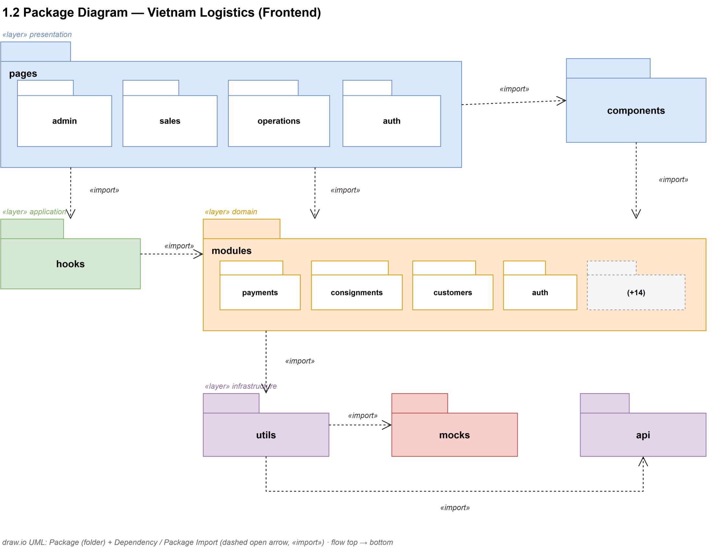

# 1.2 Package Diagram — Vietnam Logistics (Frontend)

Based on the [UML Package Diagram](https://blog.visual-paradigm.com/vn/what-is-a-package-what-is-a-package-diagram-in-uml/) concept: packages group model elements and provide a namespace; a package may contain other packages (hierarchy); the diagram shows both structure and dependencies between subsystems/modules. This diagram uses a **layered application view** reflecting the current `src/modules/<feature>/` architecture.

Drawn with **draw.io built-in UML shapes**: Package (`shape=folder`) and Dependency / Package Import (dashed open arrow + `«import»`).



> Editable source: [`vietnam-logistics-package-diagram.drawio`](./vietnam-logistics-package-diagram.drawio)

## Package hierarchy

```text
presentation
├── pages
│   ├── admin
│   ├── sales
│   ├── operations
│   └── auth
└── components
application
└── hooks
domain
└── modules
    ├── payments
    ├── consignments
    ├── customers
    ├── auth
    └── … (+14 more)
infrastructure
├── utils
├── mocks
└── api
```

## Feature modules (`src/modules/`)

Each feature module typically contains: `api.js`, `mock.js`, `mappers.js`, `index.js` (facade). UI imports the facade only.

| Module | Module | Module |
|--------|--------|--------|
| `additional-service-fees` | `auth` | `carriers` |
| `consignments` | `customers` | `messages` |
| `operations` | `package-configurations` | `payments` |
| `product-types` | `purchase-orders` | `purchase-requests` |
| `restricted-items` | `service-pricing` | `shipping-methods` |
| `staff` | `users` | `warehouses` |

## Package Descriptions

| No | Package | Path | Description |
|----|---------|------|-------------|
| 01 | `Vietnam Logistics Frontend` | `src/` | Root package (namespace) of the internal Next.js web application. |
| 02 | `presentation` | `src/app/pages`, `src/app/components` | UI layer: role-based route screens and shared UI components. |
| 03 | `pages` | `src/app/pages` | UI subsystems organized by business role (URL under `/pages/...`). |
| 04 | `admin` | `src/app/pages/admin` | Administration: users, warehouses, carriers, pricing, payments, consignments, etc. |
| 05 | `sales` | `src/app/pages/sales` | Sales: customers, consignments, purchase requests/orders, payments, messages. |
| 06 | `operations` | `src/app/pages/operations` | Operations: operational dashboard and consolidate flows. |
| 07 | `auth` | `src/app/pages/auth` | Login, forgot password, and reset password flows. |
| 08 | `components` | `src/app/components` | Shared UI: AuthGuard, DataTable, ThemeProvider, shell, etc. |
| 09 | `application` | `src/hooks` | Client-side application logic layer (state / side effects). |
| 10 | `hooks` | `src/hooks` | Custom React hooks (`useAuth`, `useConversationChat`). |
| 11 | `domain` | `src/modules` | Domain / feature logic layer. |
| 12 | `modules` | `src/modules/<feature>` | Per-feature facade: API calls, mocks, mappers. UI imports `@/modules/<feature>`. |
| 13 | `infrastructure` | `src/utils`, `src/app/api` | Shared infrastructure: HTTP client, helpers, mock core, BFF proxy. |
| 14 | `utils` | `src/utils` | Shared helpers: `apiClient`, `apiError`, routes, session, theme, date/time. Domain services belong in `modules`, not here. |
| 15 | `mocks` | `src/utils/mocks` | Mock data core (`dataSource`, `mockStore`, `mockDelay`) used by feature modules. |
| 16 | `api` | `src/app/api` | Next.js Route Handlers: `/api/[...path]` proxy and auth login/logout routes. |

## Dependencies («import»)

| From | To | Meaning |
|------|----|---------|
| `pages` | `components` | Feature UI uses shared components |
| `presentation` | `application` | UI uses hooks (auth, chat, etc.) |
| `presentation` | `domain` | Pages import feature facades from `modules` |
| `presentation` | `infrastructure` | UI uses shared helpers (`appRoutes`, `apiError`, etc.) |
| `application` | `domain` | Hooks may call domain modules |
| `domain` | `infrastructure` | Modules use `apiClient`, mocks, shared helpers |
| `utils` | `mocks` | Shared helpers / legacy paths may use mock core |
| `utils` | `api` | HTTP calls go through `/api/*` (dev proxy) to the backend |
